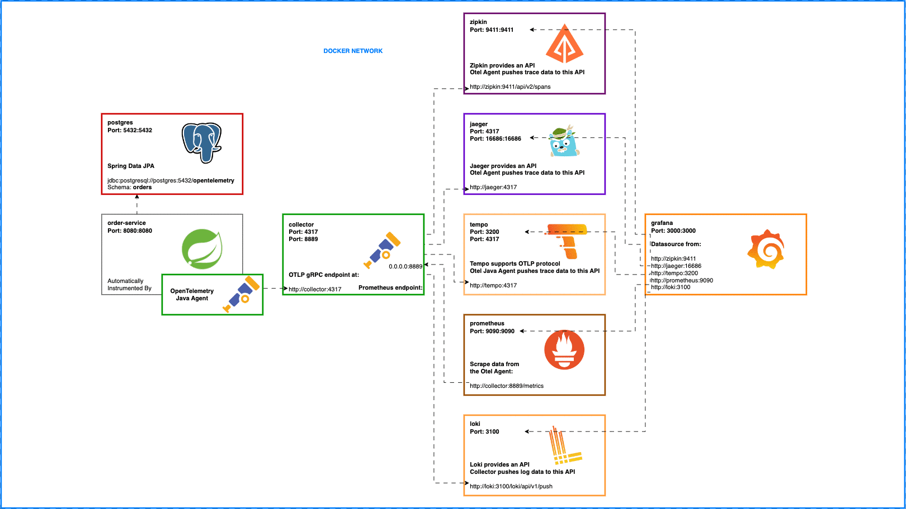

## Prerequisites
- Maven
- Docker
- Docker Compose
- Java 17

## Architecture


## Build the project
```bash 
mvn clean package
```

## Install Opentelemetry workshop and Run the project
1 - Create the docker network
```bash 
docker network create observability-network
```

2 - Run opentelemetry docker compose
```bash
docker-compose -f otel_docker-compose.yml up -d
```

3 - Run Kafka installation docker compose
```bash
docker-compose -f kafka_docker-compose.yml up -d
```
Check if Kafka is running
```bash
http://localhost:8080
```
#### Create a topic named payroll-topic
#### Create consumer group named payroll-group-id
#### Assign the consumer group payroll-group-id to the topic payroll-topic


4 - Run the microservices docker compose
```bash
docker-compose -f docker-compose.yml up -d
```

5 - Check the Grafana UI
```bash
http://localhost:3000
```
6 - Test the API with the bruno collection

